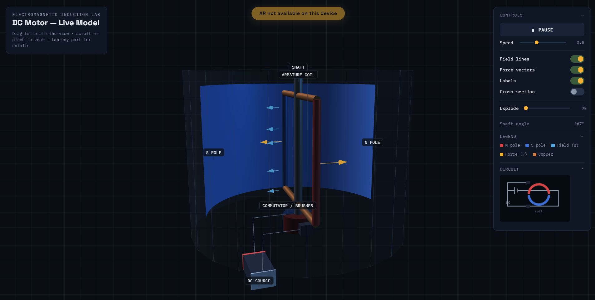
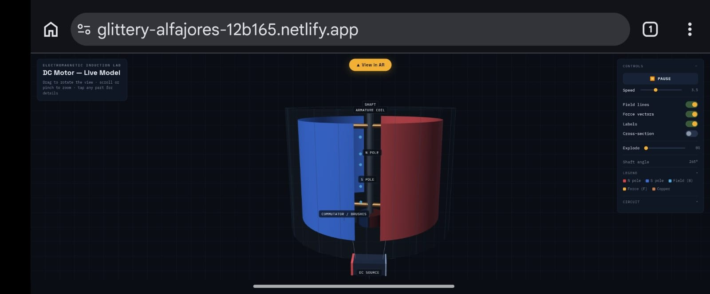
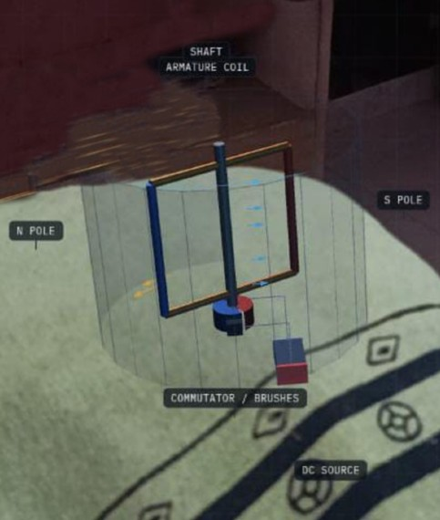

# ⚡ DC Motor — Interactive AR Learning Model

An interactive, browser-based 3D simulation of a DC motor — built to make electromagnetic induction *visible*: the field, the current-carrying coil, the commutator switching, and the resulting force and rotation. Runs on desktop as a full 3D explorable model, and on mobile as a real **Augmented Reality** experience via WebXR — no app install required.

**🔗 Demo:** [Working in Laptop](https://github.com/user-attachments/assets/1b09377f-ce7a-4975-ae87-72dd38b9867e) [Working in Mobile](docs/videos/mobile_documentation.mp4)


---

## ✨ Features

- **Real-time animated rotor** — the armature coil and shaft rotate continuously, driven by an adjustable speed model.
- **Field & force visualization** — animated field-line arrows (B) and force-vector arrows (F) update live as the coil rotates through each half-cycle, making the motor effect (F = IL × B) visible rather than abstract.
- **Cross-section mode** — a clipping plane reveals the internal shaft/coil/commutator assembly hidden behind the housing.

  

- **Explode view** — a slider pulls the N/S poles and housing apart from the shaft assembly so learners can see how the parts fit together.
- **Live circuit schematic** — an auto-drawn diagram ties the 3D model back to the standard DC-source-and-coil circuit diagram.
- **Labelled components** — shaft, armature coil, commutator/brushes, DC source, N pole, S pole — toggleable on/off.
- **Augmented Reality mode** — tap *View in AR* on an Android/Chrome device to place and view the motor in your real physical space, live-anchored to your device's camera pose.
- **Responsive UI** — a dedicated compact mobile layout with a collapsible controls panel, so the model isn't obstructed on small screens.

| Desktop | Mobile | AR (real device) |
|---|---|---|
|  |  |  |

---

## 🛠 Tech Stack

| Layer | Technology |
|---|---|
| 3D rendering | [Three.js](https://threejs.org/) r128, single WebGL canvas |
| AR | [WebXR Device API](https://www.w3.org/TR/webxr/) — `immersive-ar` session + DOM Overlay |
| Structure | Single self-contained `index.html` (inline CSS + vanilla JS, no build step) |
| Hosting | [Netlify](https://www.netlify.com/) (static site) |

No frameworks, no bundler, no `npm install` — the entire app is one HTML file.

---

## 🚀 Running locally

Because WebXR requires a [secure context](https://developer.mozilla.org/en-US/docs/Web/Security/Secure_Contexts), plain `file://` access or a local `http://` server **will not** expose the AR button — only the 3D desktop view will work locally.

**Desktop 3D view only:**
```bash
# any static server works, e.g.:
npx serve .
# then open the printed http://localhost:... URL
```

**Full AR testing (required: HTTPS):**
```bash
npx serve .
npx localtunnel --port 3000     # gives you a temporary https:// URL
```
Open the `https://` URL on an Android phone in Chrome, or deploy to any static host (Netlify, GitHub Pages, Vercel) which serves over HTTPS by default.

---

## 📱 Using AR mode

1. Open the deployed HTTPS URL on an **Android phone in Chrome** (iOS Safari does not support WebXR — see [Limitations](#-known-limitations)).
2. Tap **▲ View in AR** and grant camera permission.
3. The motor appears anchored in front of you, live-positioned from your device's real AR pose.
4. Tap **Exit AR** to return to the 3D desktop-style view.

---

## 🎛 Interactive Controls

| Control | What it does |
|---|---|
| **Play / Pause** | Starts or freezes the rotor's rotation |
| **Speed** | Adjusts rotation speed (0–10) — slow it down to study commutation |
| **Field lines** | Toggles the magnetic field (B) arrows between the poles |
| **Force vectors** | Toggles the force (F) arrows on the current-carrying coil |
| **Labels** | Toggles text labels for each component |
| **Cross-section** | Clips the housing to reveal internal geometry |
| **Explode** | Separates the assembly's parts for inspection |
| **Shaft angle** | Live readout of the rotor's current position, in degrees |

---

## 📂 Project Structure

```
dc-motor-ar/
├── index.html              # entire app — 3D scene, AR logic, UI, all inline
├── docs/
│   └── screenshots/         # images used in this README
└── README.md
```

---

## ⚠️ Known Limitations

- AR mode requires an **ARCore-capable Android device on Chrome** (or another WebXR-capable browser). It is **not available on iOS Safari**, which does not implement WebXR.
- The model is placed at a fixed distance/orientation in front of the viewer rather than anchored to a detected real-world surface, since surface-detection (hit-testing) proved unreliable across test devices.
- Only tested on a small number of devices so far — broader compatibility testing is a natural next step.

---

## 📄 License

Released under the [MIT License](LICENSE).

---

## 🙏 Acknowledgements

Built as part of an assessment activity on designing AR-based interactive learning experiences, using [Three.js](https://threejs.org/) and the [WebXR Device API](https://immersiveweb.dev/).
